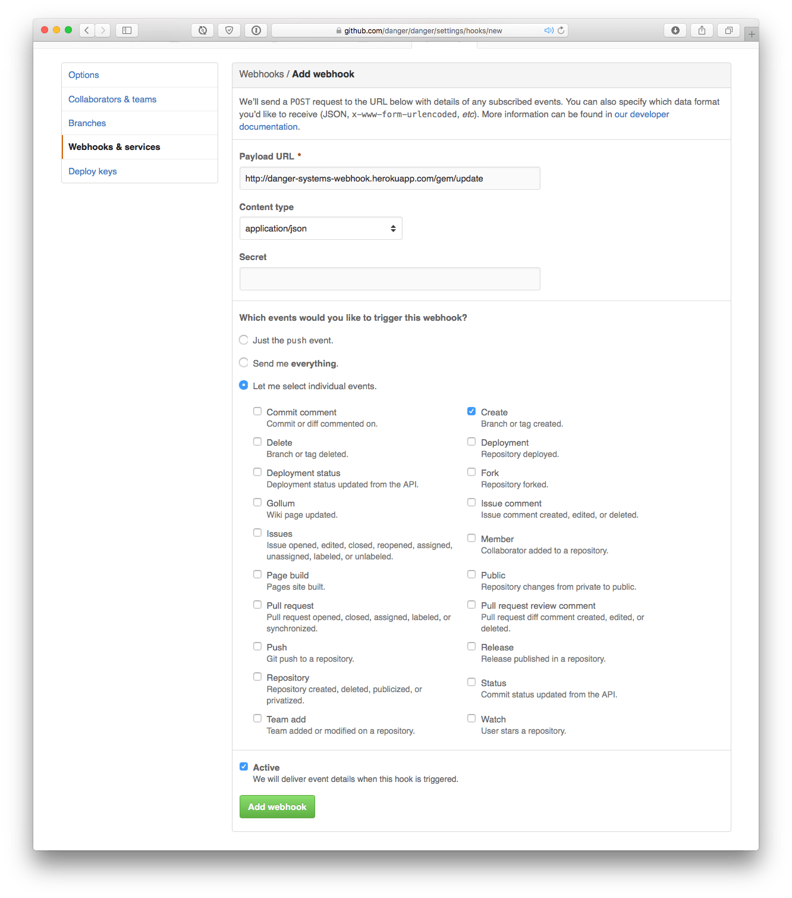

# danger.systems
The website generator for danger.systems, which is staticly generated to gh-pages

# Key Components

### plugins.json
### danger.systems
### danger-systems-webhook.herokuapp.com


To install:
``` sh
git clone https://github.com/danger/danger.systems
cd danger.systems
```

### plugins.json

The master list of all plugins to show in Danger.Systems, right now it is just the name of your plugin on rubygems.

If you'd like to add a new plugin (**awesome**) this is where you want to put it.

We'll be checking for whether you get useful metadata when you run `danger plugin lint [gem_name]` for your plugin, so please take the time to add all the extra metadata. You can see a reference [plugin here](https://github.com/dbgrandi/danger-prose) (and [a class](https://github.com/dbgrandi/danger-prose/blob/master/lib/danger_plugin.rb)). This is considered the central source of truth with respect to public plugins for Danger.

### danger.systems

The static generator for the site.

It is a similar concept [to CocoaPods.org](https://github.com/cocoapods/cocoapods.org), in that there is a collection of generated data that come from Rake tasks. This data is then used to generate the web page.

The website's data is generate from `rake generate` which pulls out plugins, then grabs the gems and generates the documentation.

You can run a copy of the static site via:

``` sh
bundle install
bundle exec rake generate
# You may need to re-run `bundle install` here
bundle exec rake serve
```

### danger-systems-webhook.herokuapp.com

This is a web service, whose job is to listen out for webhook notificatiosn for new tags on any danger-plugin.
It will trigger a call to generate the new version of danger.systems, and deploy that on gh-pages. It does this by triggering new builds on this repo from Travis CI.

You can add `http://danger-systems-webhook.herokuapp.com/gem/update` as webhook for new tags, in order to have Danger always be up-to-date in documentation on the website.

You can find the webhooks settings page at: `https://github.com/[your name]/[your repo]/settings/hooks/new`



You can run a copy of the static site via:

``` sh
bundle
bundle exec foreman start
```